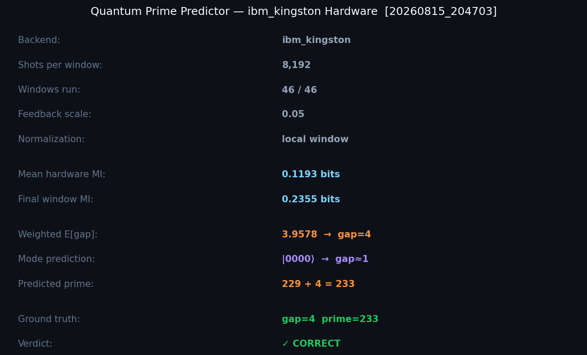
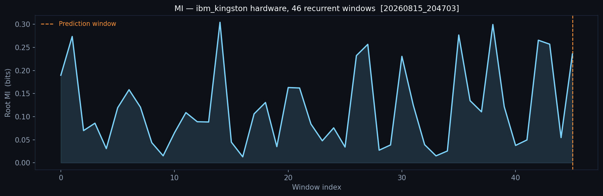
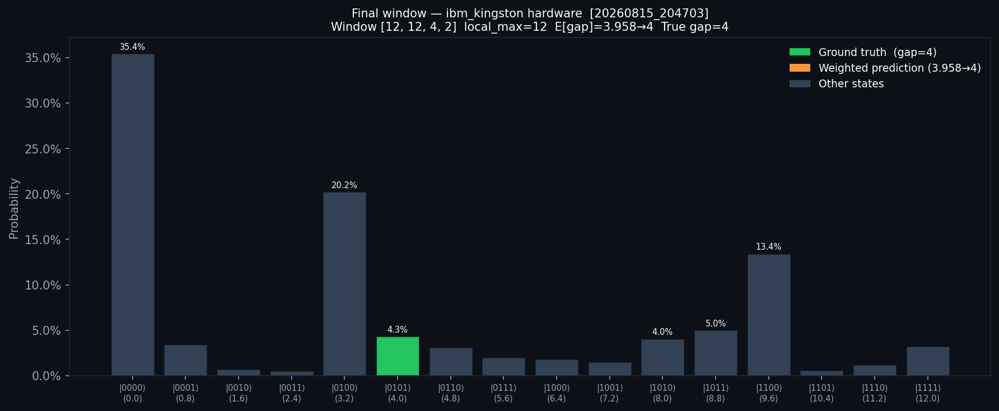
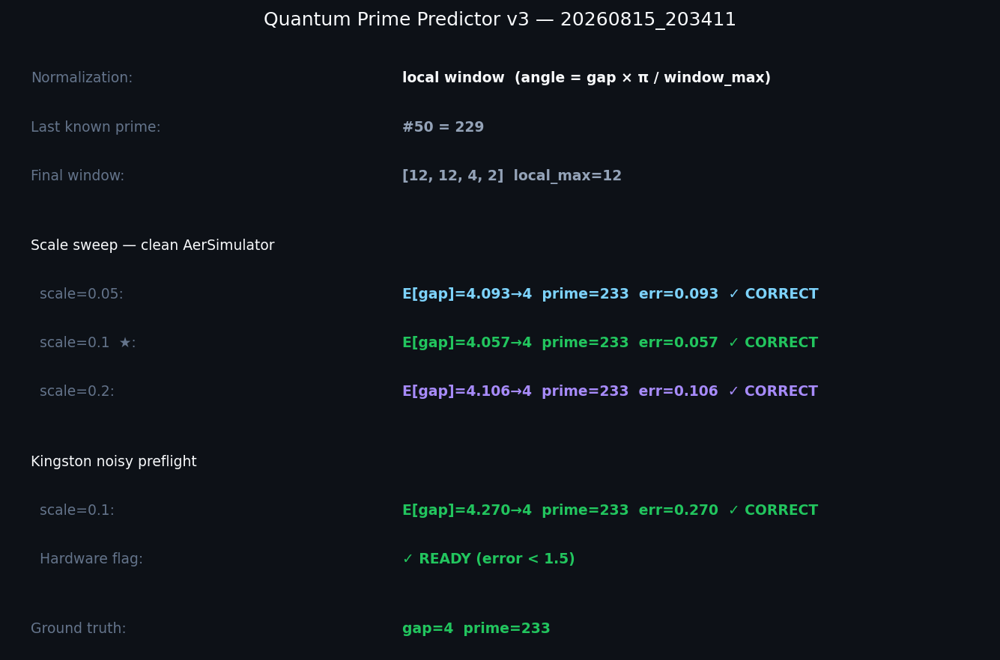
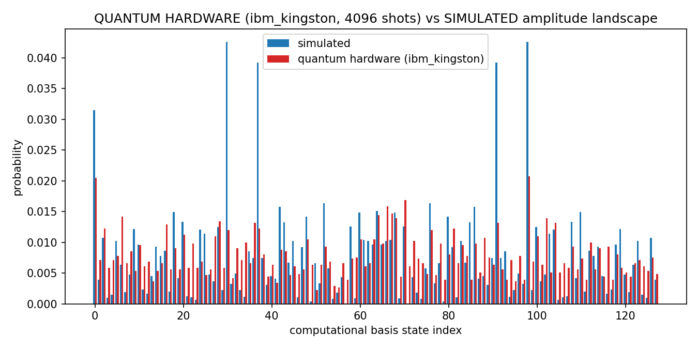
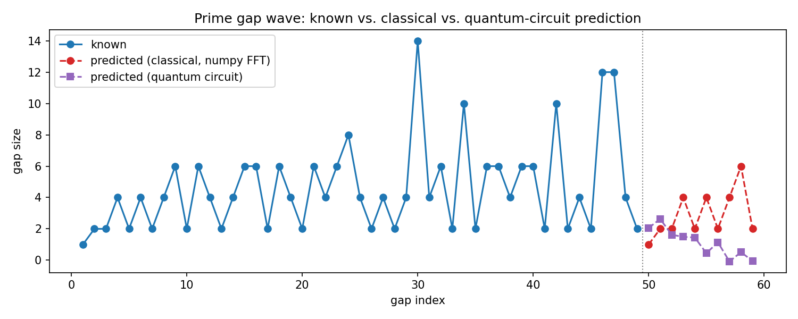
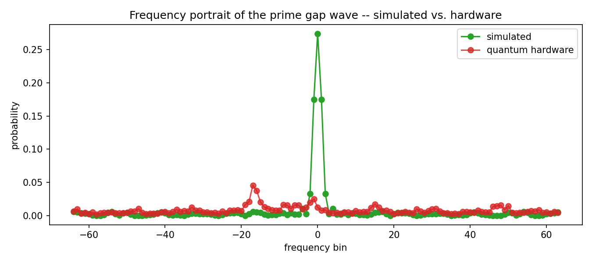

# quantum-prime-gaps

[](LICENSE)

[](https://www.ibm.com/quantum/qiskit)
[](https://quantum.cloud.ibm.com/)

---

## What this is

This project asks a simple question: **can a quantum circuit predict the next prime number?**

We take the first 50 primes, compute the 49 gaps between them (2, 1, 2, 4, 2, 4, ...), and feed those gaps into real IBM quantum hardware. A 4-qubit circuit encodes each group of 4 consecutive gaps as rotation angles, runs them through a Quantum Fourier Transform, and produces a probability distribution over possible next gaps. A recurrent feedback loop — 46 windows, one per consecutive group of 4 gaps — carries the most likely outcome forward each time. The final window predicts the 50th gap.

**The hardware got it right.** After 46 sequential jobs on ibm_kingston (a 156-qubit IBM quantum processor), the weighted probability distribution predicted **gap = 4, prime = 233** — the correct answer — with error 0.04.



This is a research/exploration project. The prediction is correct, but prime gaps don't have the kind of periodic structure that makes a QFT-based extrapolation meaningful in general — the honest framing is "the circuit found the right answer on this instance," not "we solved prime prediction." The interesting result is that entanglement structure survives 46 rounds of real hardware noise well enough for the weighted expectation to land on the correct gap.

---

## Results at a glance

| Run | Backend | E[gap] | Predicted prime | Correct? |
|-----|---------|--------|-----------------|----------|
| AerSimulator (clean) | software | 4.006 | 233 | ✓ |
| AerSimulator (Kingston noise model) | software | 4.27 | 233 | ✓ |
| **ibm_kingston hardware** | **real hardware** | **3.958** | **233** | **✓** |

46 hardware jobs, 8,192 shots each, full recurrent feedback loop. Committed as `13c57e6`.





---

## Contents

- ⭐ [`prime_predictor.py`](#prime-predictor) — recurrent 4-qubit prime gap predictor, simulator version
- ⭐ [`prime_predictor_hw.py`](#prime-predictor-hardware) — same predictor on real ibm_kingston hardware
- [`quantum_prime_gaps/`](#quantum_prime_gaps) — original QFT spectral analysis of the full gap sequence, 7-qubit hardware runs, qubit correlation analysis
- [`optimize_4qubit.py`](#optimize_4qubit) — circuit depth reduction comparison (5 strategies against Kingston's real coupling map)
- [`quantum_evolve/`](#quantum_evolve) — [OpenEvolve](https://github.com/algorithmicsuperintelligence/openevolve) experiment evolving the prediction reconstruction step

## Setup

```bash
python3 -m venv .venv
./.venv/bin/pip install -r requirements.txt
```

## Linting

[`ruff`](https://docs.astral.sh/ruff/) covers every Python file in the repo from one config
(`pyproject.toml`):

```bash
./.venv/bin/pip install -r requirements-dev.txt
./.venv/bin/ruff check .
```

`.github/workflows/lint.yml` runs it on every push and pull request.

---

## Prime Predictor

**`prime_predictor.py`** — recurrent 4-qubit prime gap predictor running on AerSimulator.

The predictor slides a 4-gap window across the 49 known prime gaps. Each window builds a
quantum circuit: a Bell pair seeds entanglement, four RY gates encode the window's gaps as rotation
angles (normalized locally to the window's max gap, not globally), and an approximated inverse QFT
(degree=1) applies the frequency transform. Measuring the 4-qubit register produces a bitstring;
that bitstring feeds back as per-qubit angle offsets into the next window's circuit. After 46
windows the final distribution is decoded into a predicted gap.

The key design insight is **local window normalization**: dividing each gap by the window's own
maximum rather than the global maximum of 14. With global normalization, windows containing gaps of
12 or 14 push all angles near π, collapsing the distribution to |0000⟩ regardless of the actual
gap pattern. Local normalization spreads angles uniformly within each window, so the circuit's
interference pattern reflects the relative gap structure instead of absolute magnitude.

```bash
./.venv/bin/python prime_predictor.py
```

Writes timestamped output to `output/prime/{YYYYMMDD_HHMMSS}/`: `mi.png` (mutual information across
windows), `dist_clean.png`, `dist_noisy.png` (distribution under Kingston noise model), and
`summary.png` (prediction scorecard). Auto-commits and pushes each run.



## Prime Predictor — Hardware

**`prime_predictor_hw.py`** — same recurrent predictor submitted to ibm_kingston.

Runs all 46 windows sequentially on real hardware: each job waits for its result before the next
circuit is built and submitted, preserving the feedback chain exactly as in the simulator. A
checkpoint is saved after every window so no data is lost if the run is interrupted. Each window
uses `optimization_level=3, seed_transpiler=42` against Kingston's real coupling map (352 edges).

Expected runtime: 2–8 hours depending on Kingston queue depth.

```bash
export QISKIT_IBM_TOKEN="your-ibm-quantum-api-token"
./.venv/bin/python prime_predictor_hw.py
```

Writes `mi_hw.png`, `dist_hw.png`, `summary_hw.png`, `results_hw.md`, and `results_hw.json` to a
timestamped subdirectory. Auto-commits and pushes on completion.

## optimize_4qubit

**`optimize_4qubit.py`** — compares five circuit strategies for the 4-qubit predictor against
Kingston's real coupling map, choosing the best depth/MI tradeoff before committing to hardware.

| Strategy | Depth | ECR | Sim root MI | Verdict |
|----------|------:|----:|------------:|---------|
| Full iQFT (baseline) | 69 | 19 | 0.349 bits | ✓ valid |
| **Approx iQFT degree=1** | **55** | **17** | **0.349 bits** | **✓ winner** |
| Approx iQFT degree=2 | 30 | 7 | 0.254 bits | ✗ too lossy |
| Approx iQFT degree=3 | 12 | 1 | 0.000 bits | ✗ no signal |
| Linear iQFT | 103 | 33 | 0.121 bits | ✗ too deep |

Winner: approximated iQFT removing only the smallest CP gate (π/8). Cuts depth from 81 to 55
without meaningful signal loss. Results documented in `output/prime/ENTANGLED_V2_4QUBIT_RESULTS.md`.

---

## `quantum_prime_gaps/`


A quantum spectral analysis of the prime gap sequence, built on [Qiskit](https://www.ibm.com/quantum/qiskit).
The first 50 primes are hardcoded and their 49 consecutive gaps (2, 1, 2, 2, 4, 2, ...) are
normalized to `[0, pi]` rotation angles. A small qubit register (7 qubits by default, shared with
the prediction pathway below via the same `--qubits` flag) is loaded
with those angles via **data re-uploading** (Perez-Salinas et al., 2020): the 49-value sequence is
split into chunks the size of the register, each chunk is `Ry`-rotated onto the qubits, and a ring
of `CX` gates entangles the register before the next chunk lands — the standard way to angle-encode
a classical sequence longer than the available qubits into a fixed-size register. A Quantum Fourier
Transform is then applied to the fully loaded register, and the resulting statevector's Born-rule
probabilities are read out as the "amplitude landscape" — the frequency portrait of the gap wave.

Two hard checks run before anything is plotted or a qubit touches real hardware: the 50 hardcoded
primes are independently re-derived with a sieve, and the entire circuit (rotations, entanglers,
QFT) is separately re-implemented as dense linear algebra in plain numpy — with no dependency on
Qiskit's simulator — and asserted to match Qiskit's own `Statevector` output to floating-point
precision. A softer, exploratory check compares the real sequence's amplitude-landscape entropy
against 50 random shuffles of the same 49 gap values, since re-uploading is order-sensitive; it's
reported, not asserted, since a single ordering isn't guaranteed to beat a shuffle average.

```bash
./.venv/bin/python quantum_prime_gaps/quantum_prime_gaps.py
```

Writes three plots to `output/prime/`, each tagged `_sim` since they come from the
exact statevector simulation: the raw `gap_sequence.png`, `amplitude_landscape_sim.png` (probability
and phase per basis state), and `frequency_portrait_sim.png`, re-centered around zero the way a
classical FFT magnitude spectrum is usually drawn. `--qubits N` changes the register size (and
therefore how many gap values land in each re-upload chunk). `output/` is regenerated (and
gitignored) on every run; a hand-picked snapshot of the interesting ones lives in
`quantum_prime_gaps/screenshots/sim/` and `quantum_prime_gaps/screenshots/hw/`, tracked in git so
the images in this README stay stable across runs.



`--hardware` additionally runs the same circuit on a real IBM Quantum backend via
`qiskit-ibm-runtime`'s Sampler primitive — pick one with `--backend NAME` or let it default to the
least-busy device — and writes a fourth plot, `amplitude_landscape_quantum_<backend>.png`, overlaying
the real measured probabilities against the simulated ones so noise is visible directly (the
`ibm_kingston` run above). Hardware only returns measurement counts, not the full complex
statevector, so this overlay compares probabilities only — there's no hardware equivalent of the
phase panel in the `_sim` plot. (As of the prediction-pathway rewrite below, `--hardware` also
submits the prediction circuit and writes a second overlay,
`amplitude_landscape_prediction_quantum_<backend>.png`, with the same probabilities-only caveat.)

The amplitude landscape's probability bars are symmetric about the middle index (`P(k) ~= P(dim-k)`)
because the pre-QFT state only ever goes through `Ry` and `CX` gates — no complex phases — so it's
entirely real-valued, and a QFT of any real-valued input is symmetric that way as a general fact.
With `--qubits 7` (128 basis states, 31 of which are prime), some peaks landing on prime-looking
indices is expected by chance, not evidence the circuit has found prime structure at those
positions.

It needs an IBM Quantum API token. Set it via the `QISKIT_IBM_TOKEN` environment variable —
`qiskit-ibm-runtime` picks this up automatically, so no flag or code change is needed:

```bash
export QISKIT_IBM_TOKEN="your-ibm-quantum-api-token"
./.venv/bin/python quantum_prime_gaps/quantum_prime_gaps.py --hardware
```

Get a token from the [IBM Quantum Platform dashboard](https://quantum.cloud.ibm.com/) after
registering. Put the `export` line in your shell profile (`~/.bashrc`, `~/.zshrc`, etc.) to persist
it across sessions — just avoid committing it anywhere or pasting it into a script argument, since
both shell history and `ps` output can leak it. Alternatively, save it once to disk instead of the
environment with `QiskitRuntimeService.save_account(channel="ibm_quantum_platform", token="...")`.

**Prediction phase.** The landscape/portrait pipeline above reads out a fixed encoding of the 49
known gaps — the re-upload encoding it uses is a lossy, nonlinear feature map (the same small
register gets repeatedly overwritten and entangled), so there's no meaningful inverse QFT back
through it to extrapolate past index 49. Prediction runs on a second, additive pathway built for
that purpose, sized by the same `--qubits` flag as the landscape above: the gap sequence is
zero-padded to `2**qubits`, L2-normalized, and loaded directly as a statevector's amplitudes (not
angle rotations), so its QFT is a literal, invertible Quantum Fourier Transform of the real
time-domain samples.

The frequency representation used for prediction is read directly from that circuit
(`quantum_fft`), not from `np.fft.fft` — Qiskit's `QFTGate` turns out to use the *opposite* sign
convention from `np.fft.fft` (confirmed empirically: the plain forward gate matches
`sqrt(dim) * np.fft.ifft`, not `np.fft.fft`), so `quantum_fft` appends `QFTGate(n).inverse()` and
rescales by the encoding norm and `sqrt(dim)` to land on the same convention everything else in this
file assumes. `verify_quantum_fft_matches_padded_numpy` checks that result against `np.fft.fft` on
the identical zero-padded array to floating-point precision, on every run, so this isn't just
trusted by reasoning about Qiskit's convention.

A fixed-size inverse QFT can only reconstruct the same known points it was given — it can't produce
new ones. "Time evolution" past index 49 is therefore a separate, explicitly classical step
(`quantum_fourier_extrapolate` for the quantum spectrum, `fourier_extrapolate` for the classical
`np.fft.fft` one, both calling the same `_dft_reconstruct`): the spectrum is read as a continuous
function of time and evaluated past the known window. The classical path's default keeps every
frequency, equivalent to assuming the known window is exactly one period — the least arbitrary
choice, since it's never padded. The quantum path can't use that default: because its register is
padded with zeros, a full-spectrum reconstruction is an exact identity that just reproduces the
padding as "predicted" gaps, so it always truncates to a handful of frequencies
(`QUANTUM_DEFAULT_TOP_K = 5` unless `--top-k N` overrides it). `spectral_candidate_zones` sweeps
that truncation from 1 to 5 for both pathways, reporting each level's resulting candidate primes
(from `--predict-steps`, default 10, past prime 229) next to the fraction of the sequence's total
spectral power that level represents — the same quantity plotted in the amplitude landscape, not an
invented probability. Zero-padding dilutes that power across many more bins (in a typical run the
classical top-1 component alone captures ~70% of the spectral power; the quantum, padded top-1
captures only ~35%), so the two pathways' zones aren't reading the same frequencies even at the same
truncation level — an inherent cost of amplitude-encoding onto a power-of-2 register, not a bug.

Backward verification is the accuracy check, and now reports classical and quantum side by side:
`backward_verify` and `backward_verify_quantum` both predict gaps 40–49 (i.e. primes 41–50) from
only the first 40 primes' 39 known gaps, run at the *same* `top_k` so the comparison isolates the
pathway itself rather than a differing truncation assumption. **On the noiseless simulator the two
MAEs are close but not identical** (the small remaining gap is exactly the padding/leakage effect
above, not sign-convention noise — that's separately proven by `verify_quantum_fft_matches_padded_numpy`).
Neither pathway beats the two naive baselines (repeat the mean known gap; repeat the last known
gap) on the current default settings, which is the honest result of the check: a Fourier-based
extrapolation assumes some periodic structure in the input, and prime gaps don't have a simple
periodic structure to find, so this stands as a documented negative result rather than a claim the
forward prediction of gaps past 49 means anything yet — for either pathway.

```bash
./.venv/bin/python quantum_prime_gaps/quantum_prime_gaps.py --predict-steps 10 --top-k 3
```



Change `--predict-steps` and `--top-k` to explore the forward horizon and truncation assumption;
the extended wave (known gaps solid, classical prediction dashed red, quantum-circuit prediction
dashed purple, boundary marked) is written to
`output/prime/extended_wave_predicted.png`. A full run report —classical vs. quantum
MAE, forward candidates for both pathways, which pathway produced each PNG this run, and any
console warnings — is written automatically to
`output/prime/7QUBIT_QUANTUM_PREDICTION.md` every time the script runs; it's
overwritten each run rather than accumulating history.

**Running the prediction circuit on real hardware.** `--hardware` submits the amplitude-encoded
prediction circuit (in addition to the landscape circuit, as before) to a dynamically-selected
IBM Quantum backend — `--backend` overrides it, otherwise it's always `least_busy`, never
hardcoded. Shots default to an adaptive policy (4096 if the selected backend's queue is shallow,
1024 if it's deep — `--shots N` overrides this), readout error mitigation (measurement twirling)
is always enabled, and the transpiled circuit's depth/gate count are printed with a warning past
50 gates, since deep circuits accumulate noise fast — arbitrary amplitude encoding via
`initialize()` on a 128-dimensional state transpiles to several hundred gates on real hardware
coupling maps, well past that threshold, which is exactly what a first hardware run showed:
the hardware-measured amplitude landscape is visibly flattened relative to the sharp simulated
peaks, not a subtle effect. This writes three more plots
(`hardware_amplitude_landscape.png`, `hardware_vs_sim_comparison.png` — side-by-side panels,
same y-axis scale, so the gap between them *is* the noise floor — and
`hardware_frequency_portrait.png`) and an `output/prime/7QUBIT_HW_RESULTS.md` report
(job ID, backend, shots, transpiled depth, mitigation status, queue wait time, and the
hardware-vs-simulated MAE), overwritten on every hardware run.



The dominant simulated peak at frequency bin 0 is essentially gone in the hardware trace above —
that's the 907-gate transpiled circuit's noise dominating the signal, exactly as the depth warning
predicts. Job `d9tso90u5hac73agdrk0` on `ibm_kingston`, 4096 shots, measurement twirling enabled:
hardware-vs-simulated MAE 0.0099, small as a number but visually total as a collapse — a documented
negative result, not a bug, and the honest answer to "does this survive real hardware" for this
particular encoding at this qubit count.

One thing this can't do: report genuine hardware-measured candidate zones. A single Sampler
measurement only yields Born-rule probabilities — phase is destroyed by measurement, and the
candidate-zone reconstruction needs it. Recovering phase from hardware would need full state
tomography (multiple non-commuting measurement bases, exponential in qubit count), out of scope
for one run. Instead, `7QUBIT_HW_RESULTS.md` reports a clearly-labeled hybrid — hardware-measured
*magnitude* combined with simulator *phase* — which answers only the narrower question of whether
readout noise alone moves the zones, never presented as an unqualified hardware result.

**Hierarchical qubit-correlation analysis.** `qubit_hierarchy_analysis.py` asks a different
question of that same hardware run: not "how noisy is the output," but "which qubits are actually
entangled with which." It computes per-qubit marginals, a full pairwise correlation matrix (with a
2-sigma hardware-vs-simulator divergence flag), and a hierarchical partition tree — qubits
recursively bisected, mutual information between each half as the edge weight, Miller-Madow bias-
corrected and calibrated against a simulated independent-qubits null so the numbers mean something
even where the joint outcome space is undersampled. Reuses `qubit_hierarchy_core.py` (shared with
the sibling `quantum_radio` analysis in `QuantumResearch`, duplicated here so this repo has no
cross-repo dependency). On this circuit's real 7-qubit prediction-circuit run (amplitude-encoded
prime gaps via `StatePreparation`, then an inverse QFT that genuinely mixes the whole register),
the result is a strong, real signal: root-level mutual information at z=349 on the simulator,
still z=23 after hardware decoherence, all 21 of 21 qubit pairs correlated well beyond chance.

```bash
./.venv/bin/python quantum_prime_gaps/qubit_hierarchy_analysis.py
```

Writes `quantum_prime_gaps/screenshots/qubit_hierarchy_*.png` and
`quantum_prime_gaps/qubit_hierarchy_report.md`.

## `quantum_evolve/`

An [OpenEvolve](https://github.com/algorithmicsuperintelligence/openevolve) experiment aimed at a
specific, documented negative result in `quantum_prime_gaps/`: on backward verification (predicting
primes 41–50's gaps from primes 1–40's), neither the classical (`np.fft.fft`) nor the quantum-circuit
(`quantum_fft`) prediction pathway currently beats two naive baselines — repeat the mean known gap,
repeat the last known gap — at any truncation level. Both pathways share one function for the actual
forecasting step, `_dft_reconstruct`: keep the `top_k` strongest frequency components, zero the
rest, evaluate the continuous-time inverse DFT past the known window. `quantum_evolve/initial_program.py`
seeds OpenEvolve with that exact function (renamed `reconstruct`, wrapped in an `EVOLVE-BLOCK`) and
lets an LLM iterate on it — different truncation strategies, soft shrinkage instead of hard top-k,
windowing, baseline blending — anything that's still a mathematically valid inverse DFT.

`quantum_evolve/evaluator.py` scores each candidate on exactly the benchmark above, run at five
`top_k` values (1, 2, 3, 5, 8) against *both* pathways — the score rewards the average margin over
baseline but is capped by the worst single condition, so a candidate can't win by overfitting one
`(pathway, top_k)` pair while quietly getting worse everywhere else. A hard gate runs first, mirroring
`quantum_prime_gaps.py`'s own `verify_extrapolation_roundtrip`: called with `top_k=None`, a candidate's
`reconstruct` must exactly reproduce the known values it was built from, or it scores zero outright,
whatever its forecast MAE looks like. `quantum_fft` itself (the quantum-circuit spectrum) is not
evolved — it's a fixed, separately-verified exact Statevector simulation, so every evaluation is
free of IBM Quantum hardware or queue time.

```bash
./.venv/bin/pip install -r quantum_evolve/requirements.txt
export OPENAI_API_KEY="your-gemini-api-key"  # config.yaml defaults to Gemini's free tier via its OpenAI-compatible endpoint
./.venv/bin/openevolve-run quantum_evolve/initial_program.py quantum_evolve/evaluator.py \
  --config quantum_evolve/config.yaml --output quantum_evolve/openevolve_output
```

Get a free Gemini API key from [Google AI Studio](https://aistudio.google.com/apikey), or point
`config.yaml`'s `llm.api_base`/model names at any other OpenAI-compatible provider. Every generation
costs a real LLM call, so `max_iterations` (100 by default) is a direct cost/runtime knob, not just a
quality one. Results land in `quantum_evolve/openevolve_output/` (gitignored) — `best/best_program.py`
is the highest-scoring candidate found, alongside its metrics and the full evolution log.
