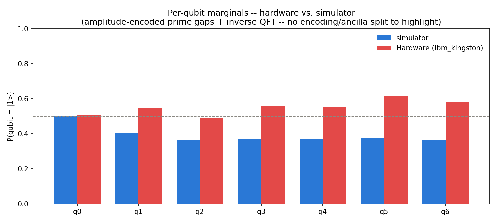
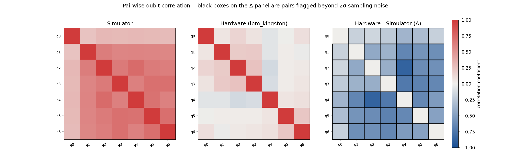
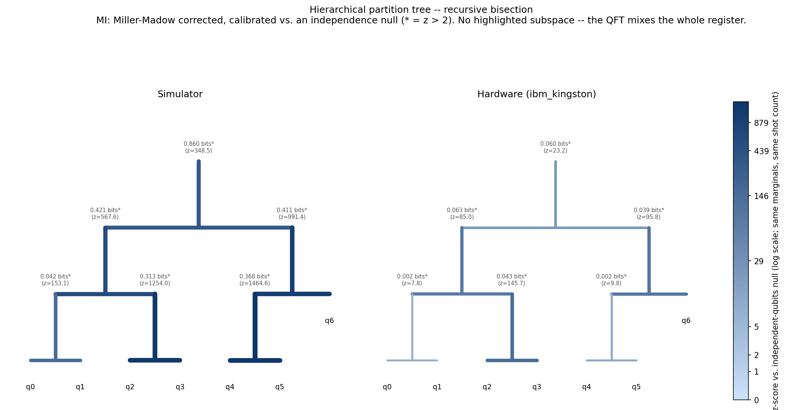

# Hierarchical qubit analysis -- quantum_prime_gaps 7-qubit prediction circuit

Same methodology as quantum_radio's hierarchical qubit analysis, applied to
quantum_prime_gaps.py's real 7-qubit prediction-circuit run: amplitude-encoded
prime gaps (`QuantumCircuit.initialize` -- a StatePreparation instruction over
the full register) followed by an inverse QFT across all 7 qubits. Unlike
quantum_radio's circuit, **the QFT genuinely mixes every qubit with every
other by construction** -- there's no arbitrary bipartition to draw here (all 7
qubits jointly carry the encoded data, no separate ancilla register), but real,
strong correlation across the whole register is exactly what this circuit
should produce, unlike quantum_radio's near-null result.

Hardware: job `d9tso90u5hac73agdrk0` on **ibm_kingston**, 4096 shots (the same job
`quantum_prime_gaps.py --dynamical-decoupling` re-fetches as "first hardware run").
Simulator: AerSimulator run of the identical circuit at the same shot count, so both
datasets carry comparable finite-sample noise.

Generated by `qubit_hierarchy_analysis.py`. Source: `quantum_prime_gaps_results_7q_prediction.json`.

## Marginals

| Qubit | P(=1) sim | P(=1) hw | Δ |
|---|---:|---:|---:|
| q0 | 0.5027 | 0.5083 | +0.0056 |
| q1 | 0.4023 | 0.5454 | +0.1431 |
| q2 | 0.3652 | 0.4924 | +0.1272 |
| q3 | 0.3696 | 0.5613 | +0.1917 |
| q4 | 0.3694 | 0.5554 | +0.1860 |
| q5 | 0.3782 | 0.6130 | +0.2349 |
| q6 | 0.3655 | 0.5801 | +0.2146 |

## Pairwise correlations

## Hierarchical partition tree

Edge weights are Miller-Madow bias-corrected mutual information (bits) between
each node's two halves, calibrated against a simulated independence null (200
synthetic independent-qubit datasets per node, same marginals and shot count --
see quantum_radio's report for why this matters more than the raw MI number).
Root-level MI (q0-q3 vs q4-q6):
simulator=0.8599 bits (z=348.55), hardware=0.0598 bits
(z=23.16).

**Partition-tree nodes exceeding z > 2 (simulator or hardware):**

- simulator: [q0,q1,q2,q3,q4,q5,q6] split -- MI=0.8599 bits, z=348.55
- simulator: [q0,q1,q2,q3] split -- MI=0.4211 bits, z=567.58
- simulator: [q0,q1] split -- MI=0.0417 bits, z=153.15
- simulator: [q2,q3] split -- MI=0.3128 bits, z=1253.96
- simulator: [q4,q5,q6] split -- MI=0.4108 bits, z=991.41
- simulator: [q4,q5] split -- MI=0.3682 bits, z=1464.64
- hardware: [q0,q1,q2,q3,q4,q5,q6] split -- MI=0.0598 bits, z=23.16
- hardware: [q0,q1,q2,q3] split -- MI=0.0628 bits, z=84.99
- hardware: [q0,q1] split -- MI=0.0018 bits, z=7.75
- hardware: [q2,q3] split -- MI=0.0432 bits, z=145.74
- hardware: [q4,q5,q6] split -- MI=0.0387 bits, z=95.76
- hardware: [q4,q5] split -- MI=0.0020 bits, z=9.85

## Qubit pairs flagged beyond 2σ

2σ threshold on |hw correlation - sim correlation|, from the 4096-shot sampling
noise on each Pearson estimate: **0.0442**.

| Pair | sim corr | hw corr | Δ |
|---|---:|---:|---:|
| q2-q4 | +0.7337 | -0.1388 | -0.8726 |
| q3-q4 | +0.6170 | -0.1148 | -0.7317 |
| q3-q5 | +0.6961 | +0.0218 | -0.6743 |
| q1-q4 | +0.5862 | -0.0689 | -0.6551 |
| q3-q6 | +0.6981 | +0.0502 | -0.6478 |
| q4-q5 | +0.6935 | +0.0548 | -0.6387 |
| q2-q5 | +0.6360 | +0.0216 | -0.6144 |
| q1-q6 | +0.5724 | -0.0247 | -0.5972 |
| q2-q6 | +0.6236 | +0.0356 | -0.5880 |
| q1-q5 | +0.5839 | +0.0196 | -0.5643 |
| q4-q6 | +0.6082 | +0.0849 | -0.5233 |
| q5-q6 | +0.7035 | +0.2208 | -0.4826 |
| q1-q2 | +0.6277 | +0.1970 | -0.4307 |
| q2-q3 | +0.6450 | +0.2440 | -0.4010 |
| q1-q3 | +0.5836 | +0.2036 | -0.3800 |
| q0-q4 | +0.3009 | -0.0662 | -0.3671 |
| q0-q5 | +0.2954 | -0.0114 | -0.3067 |
| q0-q3 | +0.2903 | +0.0673 | -0.2229 |
| q0-q6 | +0.2814 | +0.0913 | -0.1900 |
| q0-q1 | +0.2396 | +0.0524 | -0.1871 |
| q0-q2 | +0.2991 | +0.1463 | -0.1529 |
